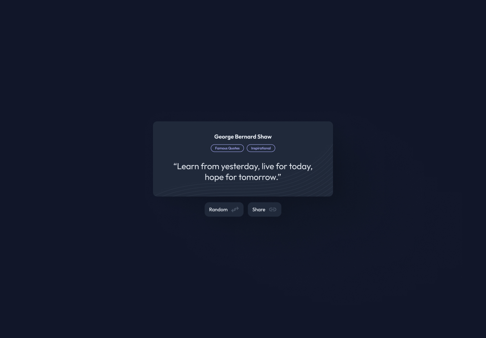

<h1 align="center">Random Quote Generator | devChallenges</h1>

   Solution for the <a href="https://devchallenges.io/challenge/random-quote" target="_blank">Random Quote</a> challenge from <a href="http://devchallenges.io" target="_blank">devChallenges.io</a>.

  <h3>
    <a href="https://your-demo-link.com">
      Demo
    </a>
     | 
    <a href="https://github.com/Javed1301/randomQuoteGenrator.git">
      Solution
    </a>
     | 
    <a href="https://devchallenges.io/challenge/random-quote">
      Challenge
    </a>
  </h3>

## Table of Contents

- [Overview](#overview)
- [What I learned](#what-i-learned)
- [Useful resources](#useful-resources)
- [Built with](#built-with)
- [Features](#features)
- [Contact](#contact)
- [Acknowledgements](#acknowledgements)

## Overview

This is a simple and responsive Random Quote Generator built as a solution to the devChallenges.io Random Quote challenge. Users can view random quotes, filter by category, and copy quotes to the clipboard for sharing.

### What I learned

- Fetching and handling JSON data from an API.
- Filtering data based on user input.
- DOM manipulation and event handling in vanilla JavaScript.
- Using the Clipboard API to copy text.
- Responsive design with CSS Flexbox and custom properties.

### Useful resources

- [MDN Web Docs - Fetch API](https://developer.mozilla.org/en-US/docs/Web/API/Fetch_API)
- [MDN Web Docs - Clipboard API](https://developer.mozilla.org/en-US/docs/Web/API/Clipboard_API)
- [devChallenges.io](https://devchallenges.io/)

### Built with

- Semantic HTML5 markup
- CSS custom properties
- Flexbox
- Vanilla JavaScript

## Features

- Display random quotes from a public API
- Filter quotes by category (e.g., Famous, Inspirational)
- Copy quotes to clipboard with a single click
- Responsive and accessible design

## Contact

- GitHub [@your-username](https://github.com/your-username)
- [your-website.com](https://your-website.com)

## Acknowledgements

- [devChallenges.io](https://devchallenges.io/)
- [Frontend Mentor](https://www.frontendmentor.io/) for inspiration
